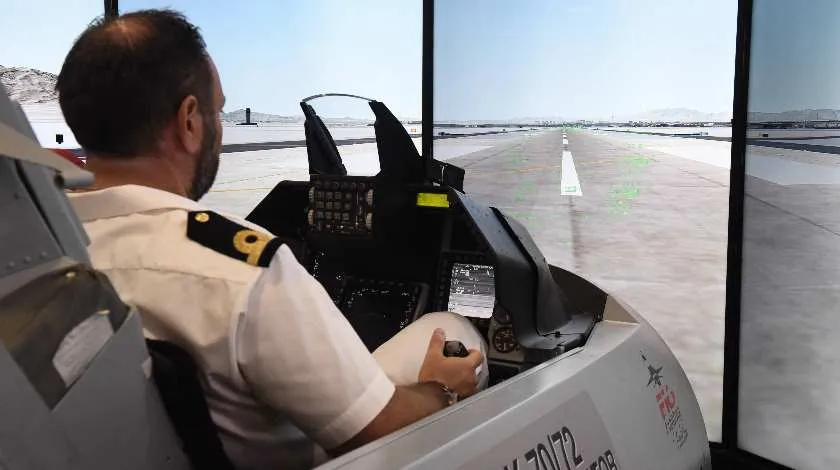

+++
title = 'Applications'
date = 2024-05-29T08:37:48+05:30
weight = 1
+++

Computer Graphics is the use of computers to create and manipulate pictures on a display device. It comprises of software techniques to create, store, modify, represents pictures. Many hardware devices algorithm has been developing for improving the speed of picture generation with time. It includes the creation storage of models and image of objects. These models for various fields like engineering, mathematical and so on.

Modern computer graphics is entirely different from the earlier one. It is interactive and user-controlled. The physical object is generated and view can be changed with user inputs. Interactive computer graphics work using the concept of two-way communication between computer users. The computer will receive signals from the input device, and the picture is modified accordingly. Picture will be changed quickly when we apply command.

### Applications of Computer Graphics

The Applications of Computer Graphics can be seen as one of the following Domains:

- Generative Static Graphics
- Image Analysis
- Interactive Environment

Let us see some of the Applications of Computer Graphics in real life:

1. VR based training - for example pilots go through vr training and testing before going on to fly a commercial plane. This reduces a lot of training costs and generate better trained pilots. Explore [here](https://vrpilot.aero/).

2. Education - for example a large chunk of biological visualisations are possible due to Computer Graphics. A very fine research paper [here](https://onlinelibrary.wiley.com/doi/abs/10.1111/j.1467-8659.1984.tb00084.x).

3. Architecture and Cartography - Town planners and transportation engineers can use computer-generated maps which display data useful to them in their planning work. Architect can explore an alternative solution to design problems at an interactive graphics terminal. In this way, they can test many more solutions that would not be possible without the computer. Generate Maps [here](https://mewo2.com/notes/terrain/)

4. Computer Art - Computer Artists used to generate television and advertising commercials using CG. Shadertoy is an online community and platform for computer graphics professionals, academics and enthusiasts who share, learn and experiment with rendering techniques and procedural art through GLSL code. View a shader [here](https://www.shadertoy.com/view/WsSBzh#). Watch full video creating the art [here](https://www.youtube.com/watch?v=8--5LwHRhjk).

The picture is in Standard Resolution while the art is in 4k :<

5. Graphics Libraries - Various popular graphing libraries employed in mathematics, engineering, and technology employ concepts of Computer Graphics. Examples of popular libraries are _MatPlotLib, Seaborn, Plotly_ in Python, _ChartJS, D3JS, ThreeJS_ in JavaScript etc. View elegant D3JS projects [here](https://d3js.org/).

This is a word parse graph made using D3JS, it can plot the weirdest of datas beautifully with excellent community support. The best example of a graph made using D3JS in my opinion is [With Love](https://www.iitk.ac.in/counsel/family_tree/).

Three.js is a cross-browser JavaScript library and application programming interface (API) used to create and display animated 3D computer graphics in a web browser using WebGL. View beautiful websites [here](https://threejs.org/).

6. Softwares for Designing - Various softwares/packages dwelve on Computer Graphics to generate structures and backbone designs of entities. Examples can be LOGO, AUTOCAD, EAGLE, Lightroom, CGI, COREL DRAW and many more. Python Turtle Documentation [here](https://opensource.com/article/21/9/logo-python-turtle).

Advanced version of AutoCad taught in TA111. These are just some of the many Applications of Computer Graphics.